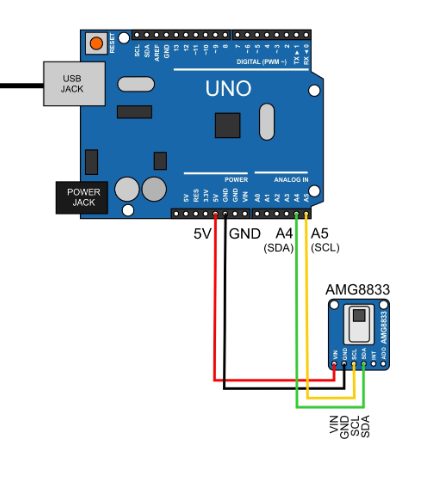

# Thermal-Detection
Excited to share my latest project update!  I've been working on a new algorithm that helps to visualize analog data using the AMG8833 thermal camera. By simply taking an array and utilizing serial communication, I've created a Python code that brings this visualization to life. 

